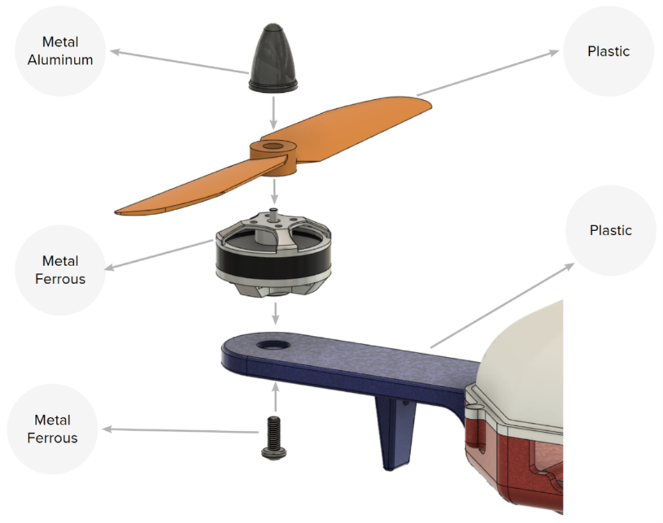

# 2023 IDETC Hackathon   Automating Material Selection for Product Design   

Welcome to the Autodesk problem statement for the 2023 IDETC hackathon!

In this challenge, your task is to come up with an open-ended solution to identify an appropriate material for a set of parts, based on their CAD geometries and assembly context. 

| **Material   Category** 	| **Definition**                           	| **Example(s)**         	|
|-------------------------	|------------------------------------------	|------------------------	|
| Metal_Aluminum          	| Aluminum-based metal                     	| Aluminum alloy         	|
| Metal_Ferrous           	| Ferrous metal (excluding carbon   steel) 	| Cast iron              	|
| Metal_Ferrous_Steel     	| Carbon steel                             	| Stainless steel        	|
| Metal_Non-Ferrous       	| Non-Ferrous metal                        	| Platinum, silver       	|
| Other                   	| Uncategorized material                   	| Glass, fabric, ceramic 	|
| Plastic                 	| Plastic                                  	| Thermoplastic          	|
| Wood                    	| Natural and engineered wood              	| Softwood               	|

## Problem Statement
- The hackathon's goal is to predict the `material_category` for each body in the [test set](dataset/test_data) (released during the hackathon). The [train data](dataset) contains material category labels for each body of each assembly in the `assembly.json` files.
- [Link to PDF]().

## Dataset
- [Download instructions](dataset). Please note that the dataset has been modified for this hackathon, and you should only use data from these download instructions in your implementation.
- **Dataset Specifications:** Please refer to [the original documentation](https://github.com/AutodeskAILab/Fusion360GalleryDataset/blob/master/docs/assembly.md) for information about the structure of the data in `assembly.json` and to find out more about the features in the dataset.

## Baseline 
- A GPT-based baseline can be found [here](baseline/gpt_baseline.ipynb).
- This can serve as an example of how to extract useful features from the data, and how to evaluate the method.

## Submission
- [Submission script]().
